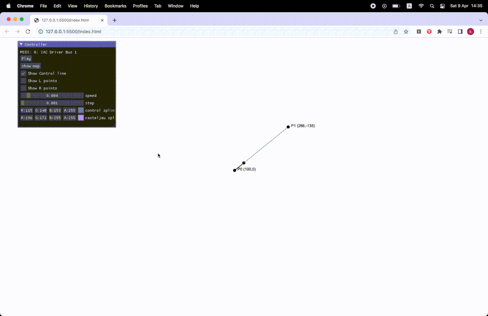

# pathseq

an implementation on [ De Casteljau's ](https://en.wikipedia.org/wiki/De_Casteljau%27s_algorithm) algorithm, capable of sending MIDI out, intentionally used for live performance.

# Resources
- https://pomax.github.io/bezierinfo/#decasteljau
- https://www.khanacademy.org/computing/pixar/animate/parametric-curves/a/equations-from-de-casteljaus-algorithm
- https://www.youtube.com/watch?v=aVwxzDHniEw
- https://webmidijs.org/docs/getting-started/basics/